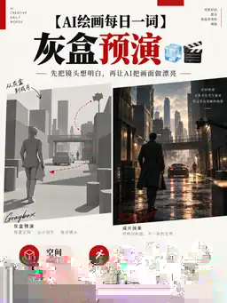

<p align="center">
  
</p>

<div align="center">

[中文](./README.zh.md) · **English**

# DerekWen AIGC Visual Skills

**德里克文 AIGC 视觉技能库**


[](https://github.com/derekwalldevin-wen/Derekwen-aigc-visual-skills/actions/workflows/validate.yml)

</div>

**30 real AIGC cases · 10 reusable Agent Skills · continuously updated**

DerekWen AIGC Visual Library is an open-source visual production library built from real image and video experiments. **Not a prompt dump** — published cases preserve final prompts, visual evidence, key control points, model notes, and reusable workflow logic.

[**Visual Gallery**](./GALLERY.md) · [**Daily Words**](./daily-words/README.md) · [**Browse 30 Cases**](./data/case-index.json) · [**Quick Start**](#quick-start)

> ⭐ **If this library helps your AI visual workflow, Star the repository to follow new cases and reusable skills as they are added.**

- **30 real cases** — finalized visual methods backed by actual generated results.
- **10 reusable Skills** — production-oriented workflows with routing, consistency rules, and failure checks.
- **Daily updates** — new “AI Visual Daily Word” experiments are continuously converted into structured Case data when finalized and publication-safe.

## Visual Case Wall

<table>
<tr><td align="center" width="33%"><a href="./skills/day-night-dual-poster/"></a><br><b>昼夜双生海报</b><br><sub>Day / Night Twin Poster</sub></td><td align="center" width="33%"><a href="./skills/geometric-flat-twin-poster/"></a><br><b>几何平涂双生海报</b><br><sub>Geometric Flat Twin Poster</sub></td><td align="center" width="33%"><a href="./skills/quirky-handdrawn-twin-poster/"></a><br><b>怪诞手绘双生海报</b><br><sub>Quirky Hand-drawn Twin Poster</sub></td></tr>
<tr><td align="center" width="33%"><a href="./skills/etched-concept-twin-poster/"></a><br><b>蚀刻概念双生海报</b><br><sub>Etched Concept Twin Poster</sub></td><td align="center" width="33%"><a href="./skills/then-now-film-twin-poster/"></a><br><b>今昔胶片双生海报</b><br><sub>Then / Now Film Twin Poster</sub></td><td align="center" width="33%"><a href="./skills/character-sheet-board/"></a><br><b>角色设定板</b><br><sub>Character Sheet Board</sub></td></tr>
<tr><td align="center" width="33%"><a href="./skills/materialized-explainer/"></a><br><b>材质化解释图</b><br><sub>Materialized Explainer</sub></td><td align="center" width="33%"><a href="./skills/memory-tile-portrait-poster/"></a><br><b>记忆切片肖像海报</b><br><sub>Memory Tile Portrait Poster</sub></td><td align="center" width="33%"><a href="./skills/shadow-theater-twin-poster/"></a><br><b>影子剧场双生海报</b><br><sub>Shadow Theater Twin Poster</sub></td></tr>
<tr><td align="center" width="33%"><a href="./skills/premium-product-launch-film/"></a><br><b>旗舰发布广告片</b><br><sub>Premium Product Launch Film</sub></td><td></td><td></td></tr>
</table>

## Latest Daily Words · 2026-09-26

The library now contains **30 Case records**. This is the latest finalized Daily Word with a public-safe generated visual example.

<table>
<tr>
<td align="center" width="33%"><a href="./daily-words/2026/09/graybox-previsualization.md"></a><br><b>灰盒预演</b><br><sub>Graybox Previsualization</sub></td>
<td></td><td></td>
</tr>
</table>

[Visual Gallery](./GALLERY.md) · [Latest data](./data/latest.json) · [Browse all Case data](./data/case-index.json) · [Daily Words](./daily-words/README.md)

## Featured Before / After

### 昼夜双生海报 · Day / Night Twin Poster

Keep the same subject and framing while creating a believable day/night state change.

| Before | After |
|---|---|
|  |  |

### 几何平涂双生海报 · Geometric Flat Twin Poster

Preserve identity and composition while translating the image into restrained geometric flat art.

| Before | After |
|---|---|
|  |  |

### 影子剧场双生海报 · Shadow Theater Twin Poster

Keep the subject unchanged and transform only the physically plausible cast shadow.

| Before | After |
|---|---|
|  |  |

### 角色设定板 · Character Sheet Board

Turn a character into a reusable identity board with views, expressions, poses, costume and hands.

| Before | After |
|---|---|
|  |  |


## Skills

| Skill | What it does | Output |
|---|---|---|
| [Day / Night Twin Poster](./skills/day-night-dual-poster/) | Keep the same subject and framing while creating a believable day/night state change. | Image |
| [Geometric Flat Twin Poster](./skills/geometric-flat-twin-poster/) | Preserve identity and composition while translating the image into restrained geometric flat art. | Image |
| [Quirky Hand-drawn Twin Poster](./skills/quirky-handdrawn-twin-poster/) | Keep the subject recognizable while amplifying personality through quirky hand-drawn treatment. | Image |
| [Etched Concept Twin Poster](./skills/etched-concept-twin-poster/) | Translate the same scene into black-and-white engraving while preserving its conceptual structure. | Image |
| [Then / Now Film Twin Poster](./skills/then-now-film-twin-poster/) | Recreate the same person and moment across contemporary and vintage-film eras. | Image |
| [Character Sheet Board](./skills/character-sheet-board/) | Turn a character into a reusable identity board with views, expressions, poses, costume and hands. | Image |
| [Materialized Explainer](./skills/materialized-explainer/) | Turn abstract flows, layers and relationships into tactile, readable explanatory models. | Image |
| [Memory Tile Portrait Poster](./skills/memory-tile-portrait-poster/) | Combine one continuous portrait with a restrained set of memory tiles. | Image |
| [Shadow Theater Twin Poster](./skills/shadow-theater-twin-poster/) | Keep the subject unchanged and transform only the physically plausible cast shadow. | Image |
| [Premium Product Launch Film](./skills/premium-product-launch-film/) | Route by product type and aim for an actual premium launch film, not a prompt-only deliverable. | Video |

## Quick Start

**1. Clone**

```bash
git clone https://github.com/derekwalldevin-wen/Derekwen-aigc-visual-skills.git
cd Derekwen-aigc-visual-skills
```

**2. Copy one Skill**

```bash
cp -R skills/day-night-dual-poster ~/.claude/skills/
```

**3. Invoke it**

```text
Use day-night-dual-poster on this photo.
Keep the subject and framing unchanged and create a believable night state.
```

Other compatible agent environments can load the corresponding `SKILL.md` directly.

## Why Skills, not Prompts?

- **Input Routing** — choose the execution path from the reference, target and aspect ratio.
- **Identity Preservation** — keep critical identity cues for people, products, characters and scenes.
- **Failure Checks** — define visual and structural failure conditions before accepting a result.
- **Artifact Generation** — the target is an actual image or video, not a text prompt presented as completion.

## Try it

```text
Use shadow-theater-twin-poster. Keep the subject unchanged and transform only the cast shadow.
```

```text
Use character-sheet-board with this character and build a consistent professional identity sheet.
```

```text
Use materialized-explainer to visualize this workflow as a tactile studio-shot model.
```

## Contributing

Issues, failure cases, model-compatibility notes and focused improvements are welcome. See [CONTRIBUTING.md](./CONTRIBUTING.md).

## Repository Layout

```text
assets/
daily-words/
data/
examples/
skills/
scripts/
GALLERY.md
README.md
README.zh.md
skills.json
```

## Asset Licensing

Visual examples are managed separately from the MIT-licensed Skill instructions. See [ASSET-LICENSE.md](./ASSET-LICENSE.md).

## License

Skill instructions, documentation and validation scripts are released under the [MIT License](./LICENSE).

---

Created by **德里克文** · GitHub [@derekwalldevin-wen](https://github.com/derekwalldevin-wen) · X [@derek_wall90176](https://x.com/derek_wall90176)
