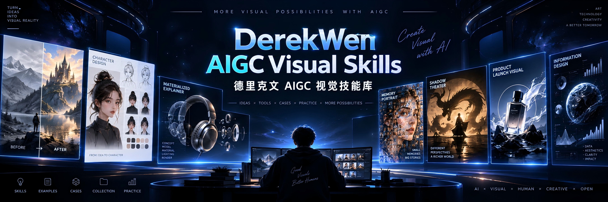
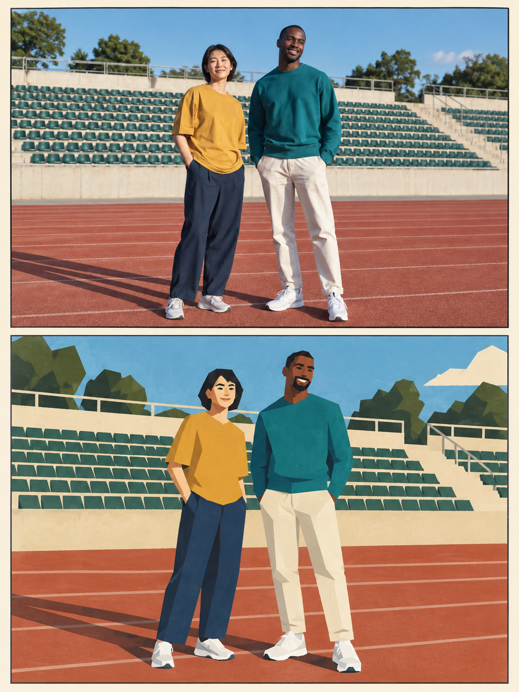
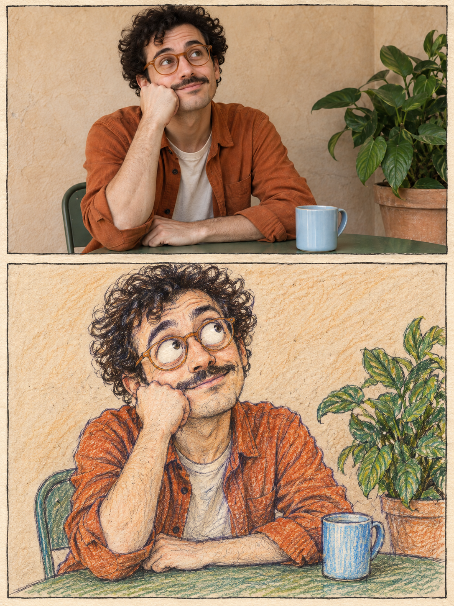
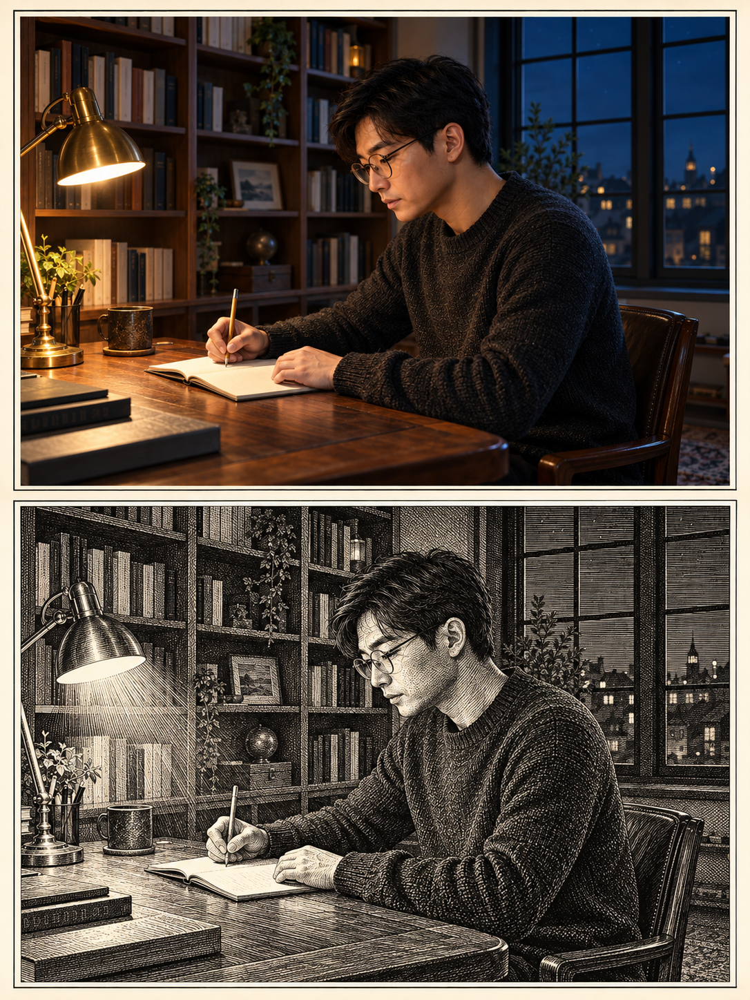
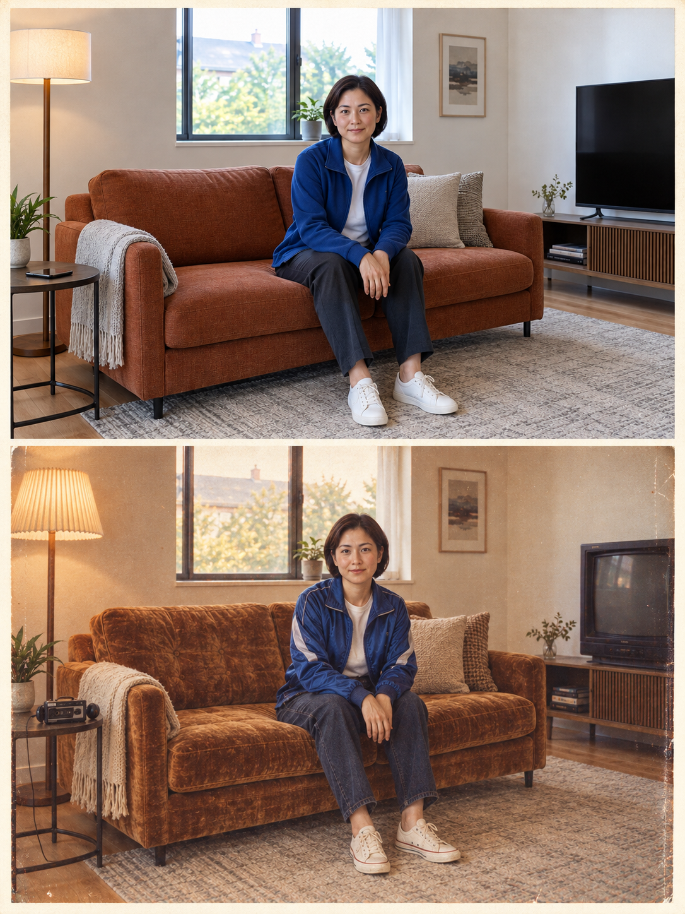
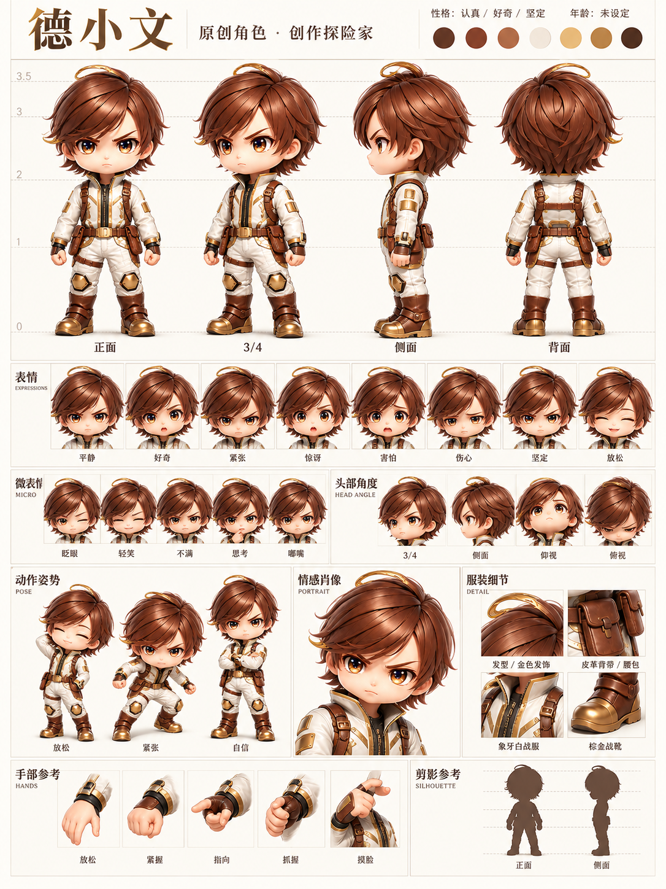
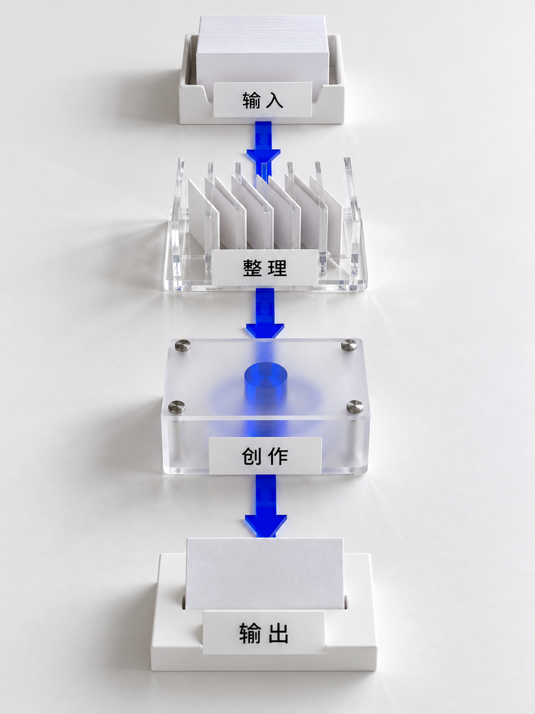
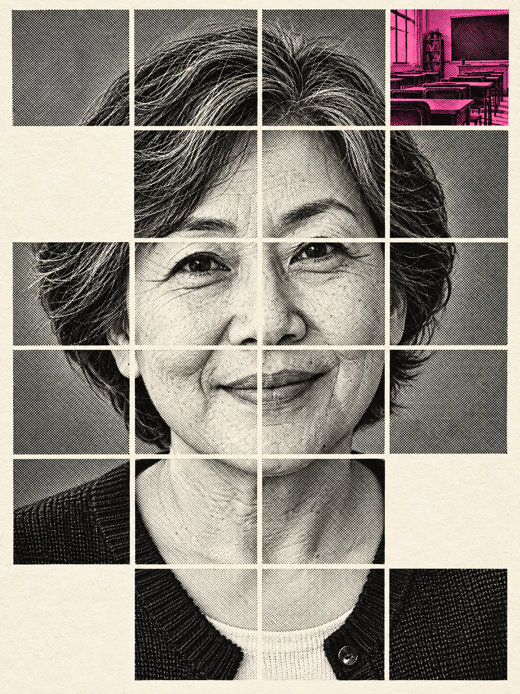
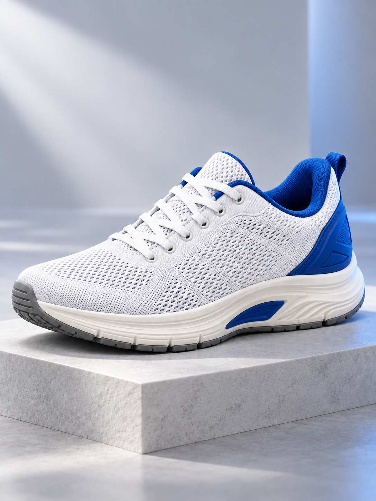
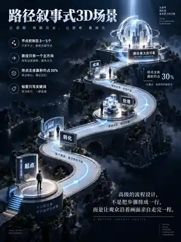

<p align="center">
  
</p>

<div align="center">

**中文** · [English](./README.md)

# DerekWen AIGC Visual Skills

**德里克文 AIGC 视觉技能库**


[](https://github.com/derekwalldevin-wen/Derekwen-aigc-visual-skills/actions/workflows/validate.yml)

</div>

**10 个生产级 AIGC 视觉 Skill。** 不是提示词合集，而是包含判断、执行、一致性控制、失败检查与实际生成的可复用视觉工作流。

[**完整视觉 Gallery**](./GALLERY.md) · [最新每日一词数据](./data/latest.json) · [全部 27 条 Case](./data/case-index.json)

## 视觉案例墙 / Visual Case Wall

<table>
<tr><td align="center" width="33%"><a href="./skills/day-night-dual-poster/"></a><br><b>昼夜双生海报</b><br><sub>Day / Night Twin Poster</sub></td><td align="center" width="33%"><a href="./skills/geometric-flat-twin-poster/"></a><br><b>几何平涂双生海报</b><br><sub>Geometric Flat Twin Poster</sub></td><td align="center" width="33%"><a href="./skills/quirky-handdrawn-twin-poster/"></a><br><b>怪诞手绘双生海报</b><br><sub>Quirky Hand-drawn Twin Poster</sub></td></tr>
<tr><td align="center" width="33%"><a href="./skills/etched-concept-twin-poster/"></a><br><b>蚀刻概念双生海报</b><br><sub>Etched Concept Twin Poster</sub></td><td align="center" width="33%"><a href="./skills/then-now-film-twin-poster/"></a><br><b>今昔胶片双生海报</b><br><sub>Then / Now Film Twin Poster</sub></td><td align="center" width="33%"><a href="./skills/character-sheet-board/"></a><br><b>角色设定板</b><br><sub>Character Sheet Board</sub></td></tr>
<tr><td align="center" width="33%"><a href="./skills/materialized-explainer/"></a><br><b>材质化解释图</b><br><sub>Materialized Explainer</sub></td><td align="center" width="33%"><a href="./skills/memory-tile-portrait-poster/"></a><br><b>记忆切片肖像海报</b><br><sub>Memory Tile Portrait Poster</sub></td><td align="center" width="33%"><a href="./skills/shadow-theater-twin-poster/"></a><br><b>影子剧场双生海报</b><br><sub>Shadow Theater Twin Poster</sub></td></tr>
<tr><td align="center" width="33%"><a href="./skills/premium-product-launch-film/"></a><br><b>旗舰发布广告片</b><br><sub>Premium Product Launch Film</sub></td><td></td><td></td></tr>
</table>

## 最新每日一词 · 2026-09-23

当前资料库已收录 **27 条 Case 记录**。以下 3 条为已定稿、已生图、通过公开安全检查的当日新增案例。

<table>
<tr>
<td align="center" width="33%"><a href="./daily-words/2026/09/high-signal-two-color-branding.md"></a><br><b>高信号双色品牌视觉</b><br><sub>High-Signal Two-Color Branding</sub></td>
<td align="center" width="33%"><a href="./daily-words/2026/09/night-flash-motion-twin.md"></a><br><b>夜闪拖影双生</b><br><sub>Night Flash Motion Twin</sub></td>
<td align="center" width="33%"><a href="./daily-words/2026/09/path-narrative-3d-scene.md"></a><br><b>路径叙事式3D场景</b><br><sub>Path-Narrative 3D Scene</sub></td>
</tr>
</table>

[完整视觉 Gallery](./GALLERY.md) · [Latest 数据](./data/latest.json) · [查看全部 Case 数据](./data/case-index.json) · [每日一词入口](./daily-words/README.md)


## 精选 Before / After

### 昼夜双生海报 · Day / Night Twin Poster

同一主体、同一构图，在昼与夜之间建立可信的时间状态转换。

| Before | After |
|---|---|
|  |  |

### 几何平涂双生海报 · Geometric Flat Twin Poster

保留主体识别度与构图，把照片转译成克制的几何平涂视觉。

| Before | After |
|---|---|
|  |  |

### 影子剧场双生海报 · Shadow Theater Twin Poster

主体不变，只把符合光源与地面的真实投影变成另一种身份。

| Before | After |
|---|---|
|  |  |

### 角色设定板 · Character Sheet Board

从德小文单体参考图，建立包含视图、表情、配色和手部的统一角色设定板。

| Before | After |
|---|---|
|  |  |


## Skills

| Skill | 作用 | 输出 |
|---|---|---|
| [昼夜双生海报](./skills/day-night-dual-poster/) | 同一主体、同一构图，在昼与夜之间建立可信的时间状态转换。 | 图片 |
| [几何平涂双生海报](./skills/geometric-flat-twin-poster/) | 保留主体识别度与构图，把照片转译成克制的几何平涂视觉。 | 图片 |
| [怪诞手绘双生海报](./skills/quirky-handdrawn-twin-poster/) | 保留“像本人”的核心识别，把情绪与性格放大成怪诞手绘。 | 图片 |
| [蚀刻概念双生海报](./skills/etched-concept-twin-poster/) | 把同一主题转译成黑白蚀刻版画，并保留原场景的概念关系。 | 图片 |
| [今昔胶片双生海报](./skills/then-now-film-twin-poster/) | 让同一个人物与瞬间在当下和胶片年代重新发生一次。 | 图片 |
| [角色设定板](./skills/character-sheet-board/) | 把角色身份、视图、表情、姿态、服装和手部组织成可复用设定板。 | 图片 |
| [材质化解释图](./skills/materialized-explainer/) | 把抽象流程、层级与关系做成可观看、可解释的实体模型图。 | 图片 |
| [记忆切片肖像海报](./skills/memory-tile-portrait-poster/) | 把连续肖像与少量记忆切片组合成克制而有情绪的网格肖像。 | 图片 |
| [影子剧场双生海报](./skills/shadow-theater-twin-poster/) | 主体不变，只把符合光源与地面的真实投影变成另一种身份。 | 图片 |
| [旗舰发布广告片](./skills/premium-product-launch-film/) | 根据产品类型组织高级发布片镜头，最终目标是实际视频而不是提示词。 | 视频 |

## 快速开始 / Quick Start

**1. Clone**

```bash
git clone https://github.com/derekwalldevin-wen/Derekwen-aigc-visual-skills.git
cd Derekwen-aigc-visual-skills
```

**2. 复制一个 Skill**

```bash
cp -R skills/day-night-dual-poster ~/.claude/skills/
```

**3. 直接调用**

```text
用 day-night-dual-poster 处理这张图。
主体和机位保持不变，生成可信的夜景状态。
```

其他兼容的 Agent 环境可以直接加载对应目录中的 `SKILL.md`。

## 为什么不是 Prompt 合集？

- **Input Routing** — 根据参考图、目标与画幅判断执行路径。
- **Identity Preservation** — 人物、产品、角色和场景的关键身份信息优先保持。
- **Failure Checks** — 每个 Skill 都明确失败条件与质量检查。
- **Artifact Generation** — 目标是实际图片或视频，不用一段 Prompt 冒充完成结果。

## Try it

```text
用 shadow-theater-twin-poster。主体不变，只转换真实投影。
```

```text
用 character-sheet-board 处理这个角色，建立统一专业的角色设定板。
```

```text
用 materialized-explainer 把这个流程做成白底、可触摸感的实体解释模型。
```

## Contributing

欢迎提交失败案例、模型兼容性问题与聚焦的规则改进。详见 [CONTRIBUTING.md](./CONTRIBUTING.md)。

## Repository Layout

```text
assets/
daily-words/
data/
examples/
skills/
scripts/
GALLERY.md
README.md
README.zh.md
skills.json
```

## 素材许可

视觉案例与 MIT 开源的 Skill 指令分开管理。详见 [ASSET-LICENSE.md](./ASSET-LICENSE.md)。

## License

Skill 指令、文档与验证脚本采用 [MIT License](./LICENSE)。

---

作者：**德里克文** · GitHub [@derekwalldevin-wen](https://github.com/derekwalldevin-wen) · X [@derek_wall90176](https://x.com/derek_wall90176)
