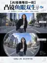

# 【AI绘画每日一词】凸镜鱼眼双生 🪞🐟

**普通照片先别删，换成8mm鱼眼试一下，整个世界都能被你拍弯。**

上传一张照片。

上半保留真实原图。下半人还是这个人，衣服不变，地方也不变，只是镜头突然变成了：**8mm极端鱼眼 / 圆形凸面镜。**

人物还在画面中心，但街道、建筑、天空、地面开始向四周弯曲。同一个地方，瞬间像换了一个世界。

## 🎯核心提示词

请基于我上传的照片，制作一张独立的 **3:4竖版「凸镜鱼眼双生」海报**，画面上下严格 **1:1分割**。

**上半：**完整保留原始照片，仅轻微统一调色。

**下半：**严格保持 **同一人物、同一张脸、同一服装、同一动作、同一地点和主体身份**，将同一场景重构为真实 **8mm极端鱼眼 / 圆形凸面镜摄影**。

要求：

- 主体位于画面中心
- 人脸保持准确，不拉坏五官
- 建筑、道路、天空和环境向边缘自然弯曲
- 越靠近边缘，球面透视越明显
- 保留真实镜面高光、边缘暗角和空间畸变
- 整体像真实鱼眼镜头拍摄，不是液化特效

**禁止：**换脸、换衣、换地点、复制人物、拉坏身体、随机扭曲物体、超现实融化、明显AI感。

## 🔁延伸玩法

**人物街拍**：最适合街道、商场、地铁口。人物不变，整个城市向四周弯开。

**旅行照片**：建筑、教堂、广场、城市地标都很好用，特别适合本身就有大量线条的场景。

**汽车照片**：车身保持完整，周围道路和建筑形成夸张球面透视。

**宠物照片**：宠物放在画面中心，环境拉开，会有很强的趣味感。

**产品照片**：鞋、相机、饮料、潮玩放在中心，周围环境做极端鱼眼，很适合潮流广告。

## ⚙️参数技巧 / 关键控制点

1. **主体尽量放中间。** 鱼眼最怕脸在边缘，人物越靠近中心，五官越稳定。
2. **要写真实镜头，不要只写“弯曲”。** 建议加入：`8mm fisheye lens`、`spherical distortion`、`convex mirror`、`extreme wide angle`、`circular perspective`。
3. **背景线条越多越出效果。** 街道、建筑、栏杆、天花板、地砖都特别适合。
4. **别把人物也一起拉坏。** 核心控制：**主体身份锁定，环境产生鱼眼畸变。**
5. **想更夸张可以做圆形凸镜版。** 让整个画面出现在交通凸面镜、商场镜面或金属反射球里，视觉冲击更强。

**测试模型：**当天记录未可靠确认具体图像模型，因此 Case 不填写具体型号。

## 📌一句话总结

**上传一张普通照片，让AI不换人、不换地方，只把整个世界拍弯。**
