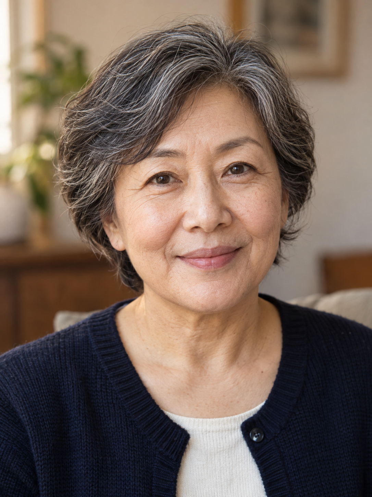

# 记忆切片肖像海报 / Memory Tile Portrait Poster

**Output: Image**

## Example

| Before | After |
|---|---|
|  |  |

The portrait and classroom are both fictional AI originals, not a real person's biography. [memory-classroom.png](./memory-classroom.png) was generated separately and passed as a second input. One supplied memory occupies one pink-and-black cell; blank cells avoid inventing additional memories. The requested 3:4 format overrides the Skill's default 9:16.

## Source and publication review

- **A — Public Safe** under the repository owner's task policy.
- Before was generated independently from text as an original fictional source image. No historical real-person photograph was used.
- After was generated in a separate image-edit call using the saved Before as input, following the corresponding Skill's visual constraints.
- Tool: Codex built-in image_gen; generated 2026-09-22. The tool does not expose a verifiable model-version string, so no IMAGE-2.5 model claim is made.
- Author: 德里克文. Publication permission does not grant a separate asset license; see [ASSET-LICENSE.md](../../ASSET-LICENSE.md).

## Generation record

The exact prompts and input-to-output mapping are recorded in [generation.json](./generation.json). Images are retained as PNG; no SVG was rasterized or used as an input.

[Open the Skill →](../../skills/memory-tile-portrait-poster/)
