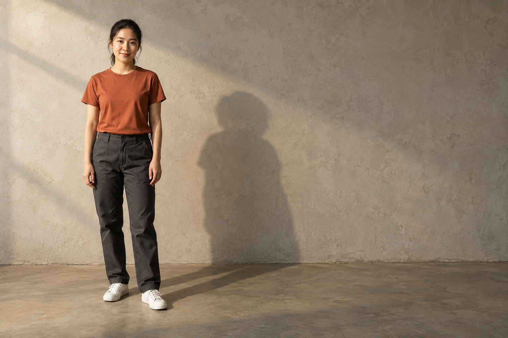
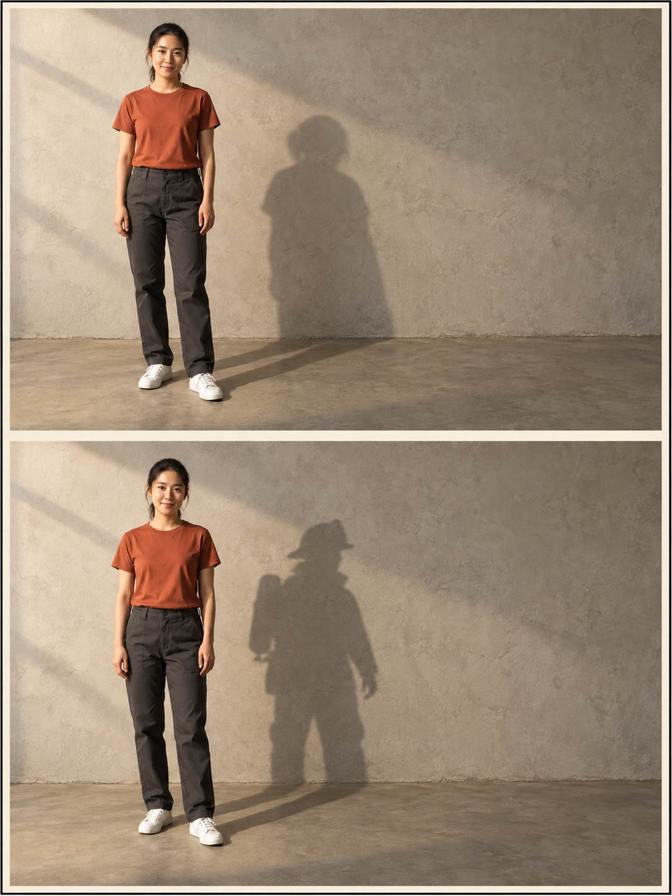

# 影子剧场双生海报 / Shadow Theater Twin Poster

**Output: Image**

## Example

| Before | After |
|---|---|
|  |  |

## Source and publication review

- **A — Public Safe** under the repository owner's task policy.
- Before was generated independently from text as an original fictional source image. No historical real-person photograph was used.
- After was generated in a separate image-edit call using the saved Before as input, following the corresponding Skill's visual constraints.
- Tool: Codex built-in image_gen; generated 2026-09-22. The tool does not expose a verifiable model-version string, so no IMAGE-2.5 model claim is made.
- Author: 德里克文. Publication permission does not grant a separate asset license; see [ASSET-LICENSE.md](../../ASSET-LICENSE.md).

## Generation record

The exact prompts and input-to-output mapping are recorded in [generation.json](./generation.json). Images are retained as PNG; no SVG was rasterized or used as an input.

[Open the Skill →](../../skills/shadow-theater-twin-poster/)
