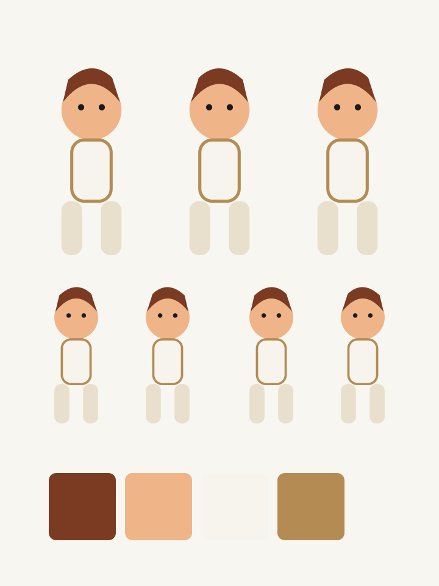

# 角色设定板 / Character Sheet Board

把角色身份、视图、表情、姿态、服装和手部组织成可复用设定板。

**Output:** Image  
[View `SKILL.md`](./SKILL.md)

## Example

| Before | After |
|---|---|
|  |  |

This is a public-safe documentation demo created specifically for the repository.

## Use

```text
Use character-sheet-board with this character and build a consistent professional identity sheet.
```

中文调用：

```text
用 character-sheet-board 处理这个角色，建立统一专业的角色设定板。
```

## Install

```bash
cp -R skills/character-sheet-board ~/.claude/skills/
```

Other compatible agent environments can load the corresponding `SKILL.md` directly.

## License

Skill instructions are covered by the repository [MIT License](../../LICENSE). Visual examples follow [ASSET-LICENSE.md](../../ASSET-LICENSE.md).
