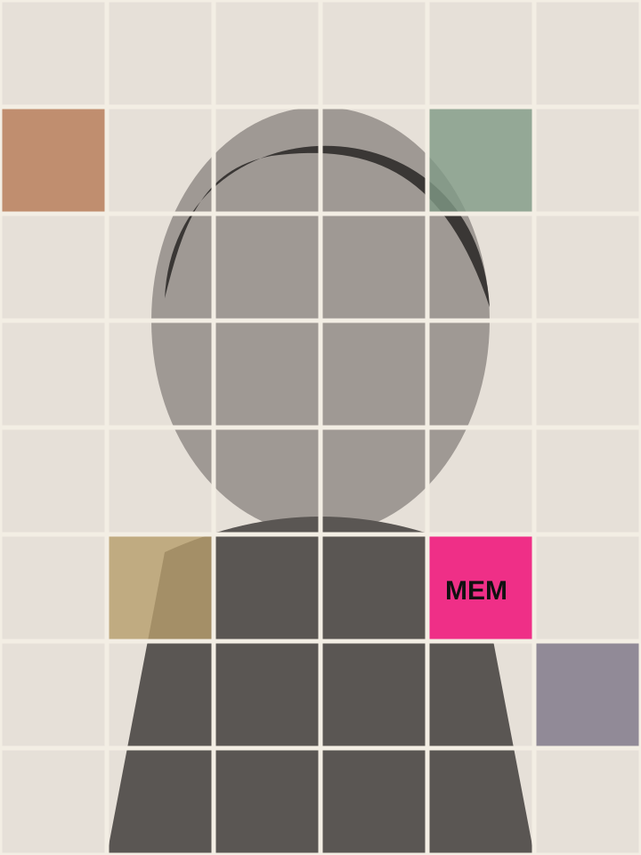

# 记忆切片肖像海报 / Memory Tile Portrait Poster

把连续肖像与少量记忆切片组合成克制而有情绪的网格肖像。

**Output:** Image  
[View `SKILL.md`](./SKILL.md)

## Example

| Before | After |
|---|---|
|  |  |

This is a public-safe documentation demo created specifically for the repository.

## Use

```text
Use memory-tile-portrait-poster. Keep one continuous face and embed only a few memory tiles.
```

中文调用：

```text
用 memory-tile-portrait-poster。保持一张连续人脸，只嵌入少量记忆切片。
```

## Install

```bash
cp -R skills/memory-tile-portrait-poster ~/.claude/skills/
```

Other compatible agent environments can load the corresponding `SKILL.md` directly.

## License

Skill instructions are covered by the repository [MIT License](../../LICENSE). Visual examples follow [ASSET-LICENSE.md](../../ASSET-LICENSE.md).
